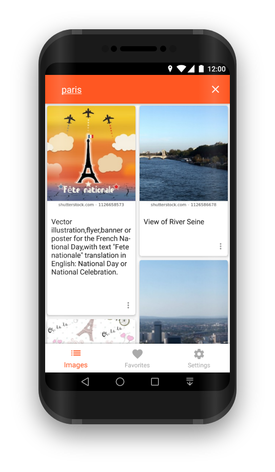
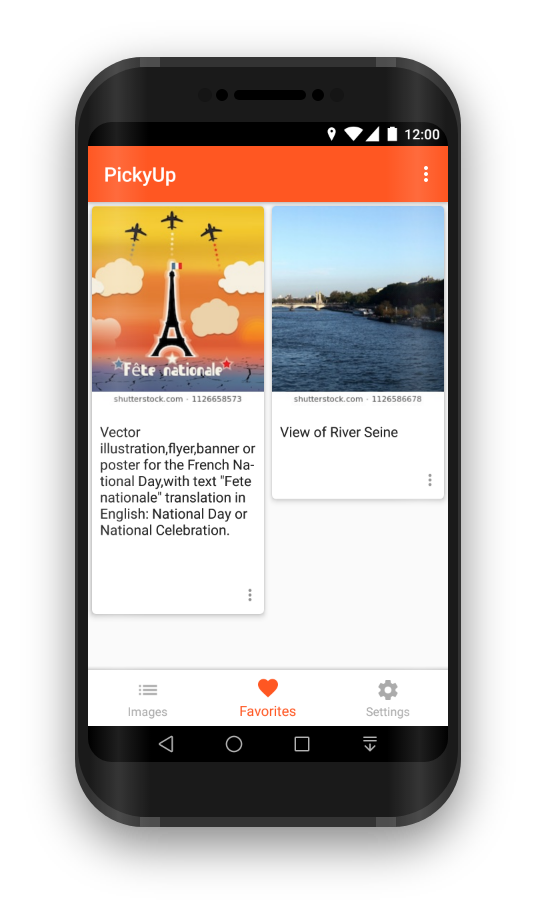
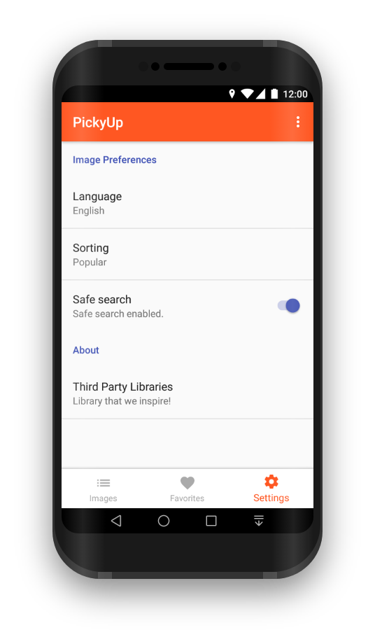
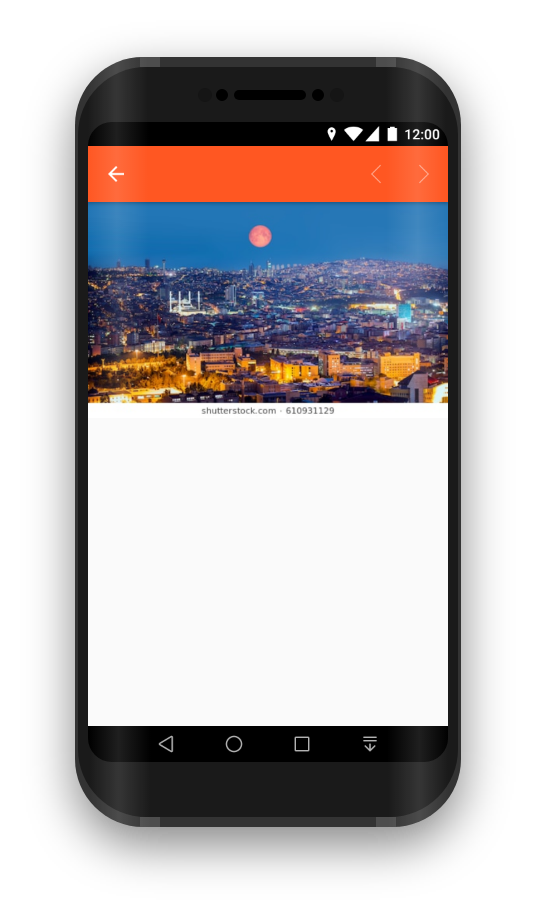

# PickyUp

<p align="center"></p>

:boom: This project is a hiring task by [upday for Samsung](https://www.upday.com/en/).

[](https://travis-ci.org/nuhkoca/pickyup-assessment)

PickyUp is an image search app that uses [Shutterstock API](https://developers.shutterstock.com/getting-started) in the backend. Users can search any image with different type of settings. They can also add images to their favorite lists.

Please visit [Shutterstock Developer Page](https://developers.shutterstock.com/getting-started) to obtain your own Bearer Token.

### Configuration

In order to run this project, you need to get your own **token** from [Shutterstock](https://developers.shutterstock.com/getting-started)

Then set your token in the `gradle.properties` file as follows:

    BEARER_TOKEN = "your token"

You also need create a Firebase Project and download **google-services.json** in order to use Firebase Admob. Please refer to the [Firebase Console](https://console.firebase.google.com/u/0/) and [Google Admob](https://apps.admob.com/v2/home).

### Features

- [x] Users can search any image with query.
- [x] Users can add images to their favorite lists.
- [x] Users can remove any image from their favorite list.
- [x] Users can change search criteria by the Settings page.
- [x] Users can view original size of any image by the WebView page.

### Screenshots

#### Phone

Images Screen             |  Favorites Screen |  Settings Screen | WebView Screen
:-------------------------:|:-------------------------:|:-------------------------:|:-------------------------:
  |   |   | 


#### Tablet

_Soon_ - **Genymotion doesn't support screenshot for free licenses.**

### Description of the problems and solution s

1. Bottom Navigation View was overlapping RecyclerView's items. That is why **56dp**(Bottom Navigation View height) padding was used for the ViewPager which holds Fragments. [Link](https://github.com/nuhkoca/pickyup-assessment/blob/master/app/src/main/res/layout/activity_main.xml#L17)
2. Snackbar was insisting to placed in front of the Bottom Navigation View and it was fixed using **56dp-~170px with drop shadow**(Bottom Navigation View height) margin bottom. [Link](https://github.com/nuhkoca/pickyup-assessment/blob/master/app/src/main/java/com/upday/shutterdemo/pickyup/utils/SnackbarUtils.java#L69)
3. App used to close when back pressed even if search bar is not empty. This is because **Custom SearchView** was created and query checking mechanism was implemented when back pressed. If search bar is not empty, in first backpresses, SearchView gets collapsed and cleaned then app is closed. [Link](https://github.com/nuhkoca/pickyup-assessment/blob/master/app/src/main/java/com/upday/shutterdemo/pickyup/ui/MainActivity.java#L182)
4. Query used to not preserve its state in case of screen rotation and users had to re-type their queries. Therefore **saveInstanceState** was implemented. [Link](https://github.com/nuhkoca/pickyup-assessment/blob/master/app/src/main/java/com/upday/shutterdemo/pickyup/ui/images/ImagesFragment.java#L310)
5. In very first run, app was crashing due to the fact that onSharedPreferenceChanged method was called even if values have their existing ones. A logic that controls first run was developed and the crash is avoided. [Link](https://github.com/nuhkoca/pickyup-assessment/blob/master/app/src/main/java/com/upday/shutterdemo/pickyup/ui/images/ImagesFragment.java#L335)
6. Images on WebView were too big and it was fixed by a couple of code block. [Link](https://github.com/nuhkoca/pickyup-assessment/blob/master/app/src/main/java/com/upday/shutterdemo/pickyup/ui/WebViewActivity.java#L74)
7. No more issue! :)

### Reasoning technical choices

1. **PagingLibrary** is used to have smoother scrolling and to avoid boilerplate.
2. **Room Persistence Library** is used to keep favorite items. It is selected since it is a part of Architecture Components.
3. **MVVM Pattern** is implemented as the parent pattern of the application. MVVM provides;
* ViewModels are simple classes that interacts with the logic/model layer and just exposes states/data and actually has no idea by whom or how that data will be consumed. Only View(Activity) holds the reference to ViewModel and not vice versa, this solves our tight coupling issue. A single view can hold reference to multiple ViewModels.
* ViewModels are even more Unit Test friendly as they just expose the state and hence can be independently tested without requiring the need for testing how data will be consumed, In short there is no dependency of the View.

4. **Retrofit - RxJava** couple is implemented since Retrofit is the best and light-weight HTTP library. It can also work great with RxJava's adapter.

* **Rx** are a set of interfaces and methods which provide a way to developers to solve problems rapidly, simply to maintain, and easy to understand. RxJava provides just that, a set of tools to help you write clean and simpler code.

5. **Stetho** is used to track network and database progresses over browser.
6. **Gson** is chosen to serialize comfortably web-service outputs as it provides an opportunity to serialize nulls, though.
7. **Bottom Navigation View with ViewPager** is implemented since the app has a small set of sreen.

### Trade-offs in case of additional time

1. I would implement offline data for the Images Screen in case of no internet instead of error.
2. I would have more options in the Settings Screens instead of a limited one.
3. I would create another screens for footage and videos, too.
4. I am very familiar with [Travis CI](https://travis-ci.org/) but I cannot fix an issue if a project has secret keys. It fails constantly and I cannot go further. If I fix that issue I will be able to integrate a CI tool properly. This project is also connected to Travis but it fails :)

### Link to other codes that I might be proud of

1. [Trippo - My Capstone Project as part of Google's Android Scholarship Program](https://github.com/nuhkoca/Trippo-The_Travel_Guide)
2. [News App - My workout for the latest technologies](https://github.com/nuhkoca/NewsApp-MVVM-AAC-Room-DataBinding-RxJava2-Retrofit2-Glide4)
3. [XYZ Reader App - Google Project's 5th task](https://github.com/nuhkoca/udacity-xyz-reader-app)
4. [Baking App - Google Project's 3rd task](https://github.com/nuhkoca/udacity-baking-app) - ExoPlayer and Widgets are implemented
5. [My Workout about Firebase ML Kit in Kotlin language](https://github.com/nuhkoca/firebase-mlkit-samples) - I try staying update with the latest technologies so that developed that app which recognizes texts, faces and labels.

### Link to my resume/portfolio

1. [My Personal Website](http://nuhkoca.com/)
2. [My Linkedin - CV is acceessible](https://www.linkedin.com/in/nuhkoca/)
3. [My Google Dev Account](https://play.google.com/store/apps/dev?id=9011472759199976374)
4. [My Certificate by Google and Udacity](https://graduation.udacity.com/confirm/QCFKLFFH)

### Credits

* [Support Library](https://developer.android.com/topic/libraries/support-library/)
* [MVVM Pattern](https://github.com/googlesamples/android-architecture)
* [Architecture Components](https://developer.android.com/topic/libraries/architecture/)
* [BindingAdapter](https://developer.android.com/reference/android/databinding/BindingAdapter.html)
* [ConstraintLayout](https://developer.android.com/training/constraint-layout/)
* [Retrofit2](https://github.com/square/retrofit)
* [RxJava2](https://github.com/ReactiveX/RxJava)
* [Glide](https://github.com/bumptech/glide)
* [GlideModule](http://bumptech.github.io/glide/doc/generatedapi.html#availability)
* [Timber](https://github.com/JakeWharton/timber)
* [OkHttp](https://github.com/square/okhttp)
* [DataBinding](https://developer.android.com/topic/libraries/data-binding/index.html)
* [Room Persistence Library](https://github.com/googlecodelabs/android-room-with-a-view)
* [Paging Library](https://developer.android.com/topic/libraries/architecture/paging/)
* [PreferenceScreen v14](https://developer.android.com/reference/android/preference/Preference)
* [Stetho](http://facebook.github.io/stetho/)
* [Espresso](https://github.com/googlesamples/android-testing)
* [About Libraries](https://github.com/mikepenz/AboutLibraries)
* [Google Admob](https://www.google.com/admob/)


### License

**App icon based on:**

Icons made by Freepik from www.flaticon.com is licensed by CC 3.0 BY

**Some icons in the app based on:**

Icons made by Freepik from www.flaticon.com is licensed by CC 3.0 BY

```
MIT License

Copyright (c) 2018 Nuh Koca

Permission is hereby granted, free of charge, to any person obtaining a copy
of this software and associated documentation files (the "Software"), to deal
in the Software without restriction, including without limitation the rights
to use, copy, modify, merge, publish, distribute, sublicense, and/or sell
copies of the Software, and to permit persons to whom the Software is
furnished to do so, subject to the following conditions:

The above copyright notice and this permission notice shall be included in all
copies or substantial portions of the Software.

THE SOFTWARE IS PROVIDED "AS IS", WITHOUT WARRANTY OF ANY KIND, EXPRESS OR
IMPLIED, INCLUDING BUT NOT LIMITED TO THE WARRANTIES OF MERCHANTABILITY,
FITNESS FOR A PARTICULAR PURPOSE AND NONINFRINGEMENT. IN NO EVENT SHALL THE
AUTHORS OR COPYRIGHT HOLDERS BE LIABLE FOR ANY CLAIM, DAMAGES OR OTHER
LIABILITY, WHETHER IN AN ACTION OF CONTRACT, TORT OR OTHERWISE, ARISING FROM,
OUT OF OR IN CONNECTION WITH THE SOFTWARE OR THE USE OR OTHER DEALINGS IN THE
SOFTWARE.
```
